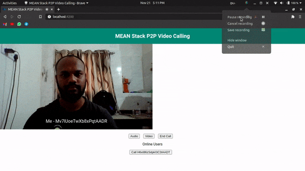

# P2P Video Calling With MEAN Stack

A Basic Video P2P Video Calling Implemented Using Angular, Node and Express Js With the Help of Socket and WebRTC.

WebRTC is a free, open-source project that provides web browsers and mobile applications with real-time communication via simple application programming interfaces.

This project was generated using [Nx](https://nx.dev).

## Demo

## Installation and Setup Instructions

Clone this repository or download.

### 1. Frontend

-   Install angular cli with npm by running `npm i -g @angular/cli`
-   Install project dependencies by running `npm i`
-   Run project locally by running `npm run client`
-   Open `http://localhost:4200/` in the browser

### 2. Backend

-   Run project locally by running `npm run server`
-   APIs will start running on `http://localhost:3000/`

### Credits

1. [A Bunch of WebRTC Goodness!](https://www.youtube.com/watch?v=BpN6ZwFjbCY&list=PLK0STOMCFms4nXm1bRUdjhPg0coxI2U6h)
2. [Nx](https://nx.dev)
